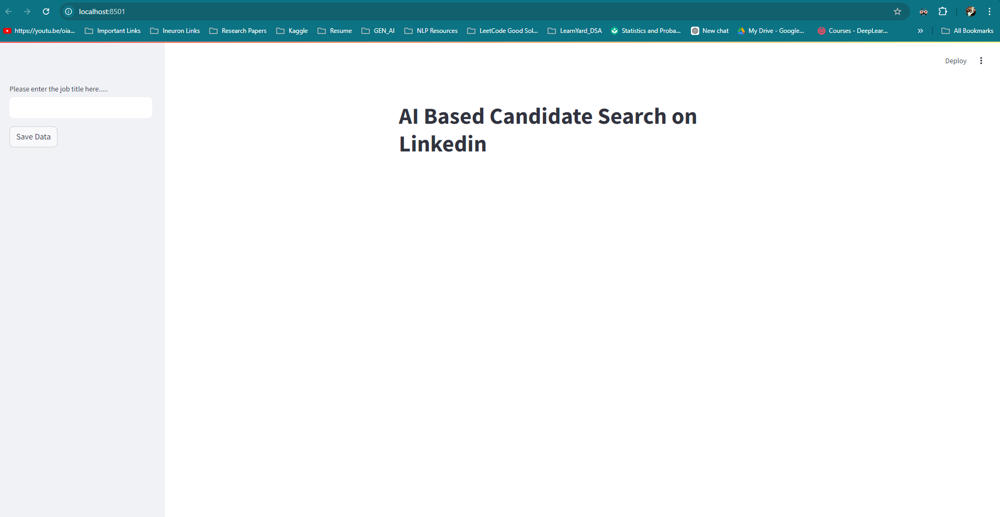
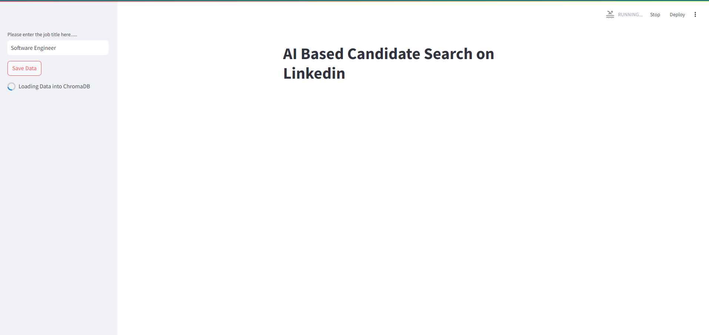
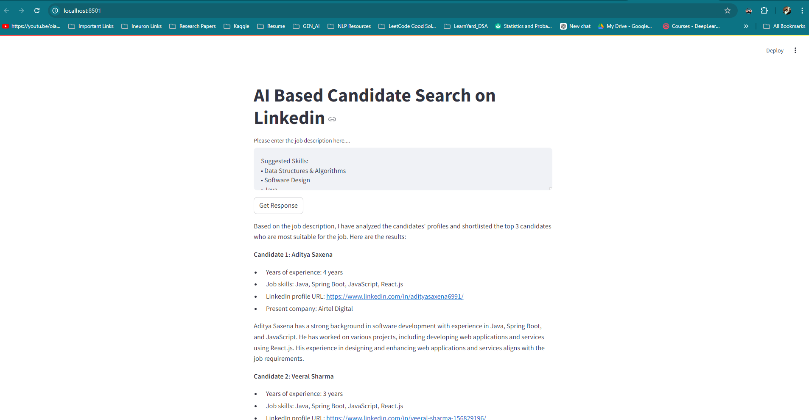

# Description
This a AI assistant to help the recuriters to find the relevant candidates based on the given job description. As a user you just need to enter the job title for whom to need to search for like Business Analyst, Software Engineer and the description of the job. It will report out candidates which are
most suitable for the job and there by help the recuriter to find the candidates easily


# Setup
1. First clone this repo into your local directory with the below command
```cmd
git clone https://github.com/guptadikshant/Linkedin-Job-Search-Agent
```
2. Once that is done, setup a virtual environment with the below command
```cmd
conda create -p <environment name> python=<python version> -y
``` 
3. Once above steps are done, then install requirements.txt file
```cmd
pip install -r requirements.txt
```
4) Now go to [GROQ](https://console.groq.com/keys) or [Google](https://aistudio.google.com/app/apikey) to generate an API key for the model and the create an .env file and place in the same directory in which we have clone the repo.
Use the **.env.template** file to generate the same .env file
5) Once this is all done, run the streamlit app using the below command
```cmd
streamlit run app.py
```
6) A server with localhost will open in the browser like below



Enter the job title first as it first needs to save the data about that particular job title. Once the data is saved we can supply the job description and we will get the job profiles like below


Output:

